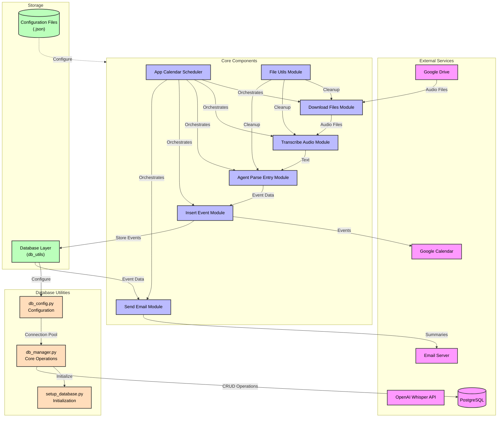

# Voice Calendar System Architecture

## System Flow Diagram



## Component Details

1. **External Services**
   - Google Drive: Source of voice recording files
   - Google Calendar: Target for calendar events
   - OpenAI Whisper API: Audio transcription service
   - Email Server: For sending event summaries

2. **Core Components**
   - App Calendar Scheduler: Main orchestrator
   - Download Files Module: Handles Google Drive integration
   - Transcribe Audio Module: Manages audio transcription
   - Agent Parse Entry Module: Extracts event data from text
   - Insert Event Module: Manages calendar operations
   - Send Email Module: Handles notifications
   - File Utils Module: Manages file operations

3. **Storage**
   - PostgreSQL Database: Stores event data
   - Configuration Files: JSON-based configuration

## Key Features

- OS-agnostic implementation
- Configuration-driven architecture
- Production-ready error handling
- Automated scheduling
- Email notifications
- File cleanup management 

## Database Architecture

### 1. Database Configuration (`db_config.py`)
- **Configuration Management**
  - Loads database configuration from JSON files
  - Provides fallback default configuration
  - Supports multiple environment configurations
  - Handles logging setup with rotation
  
- **Environment Handling**
  - Searches for `.env` file in multiple locations:
    - Local package directory
    - Package resources
    - Current working directory
    - User's home directory
    - System-wide config
  - Provides default database URL if not configured

### 2. Database Manager (`db_manager.py`)
- **Connection Management**
  - Uses connection pooling (1-10 connections)
  - Efficient connection reuse
  - Automatic connection cleanup

- **Core Operations**
  - Table creation and schema management
  - CRUD operations for calendar events
  - Date-range based queries
  - JSON handling for complex data types

- **Event Table Schema**
```sql
CREATE TABLE calendar_events (
    id SERIAL PRIMARY KEY,
    summary TEXT,
    location TEXT,
    description TEXT,
    start_dateTime TEXT,
    start_timeZone TEXT,
    end_dateTime TEXT,
    end_timeZone TEXT,
    attendees TEXT,      -- JSON string
    recurrence TEXT,     -- JSON string
    reminders TEXT,      -- JSON string
    visibility TEXT,
    colorId TEXT,
    transparency TEXT,
    status TEXT
)
```

### 3. Database Setup (`setup_database.py`)
- **Initialization Process**
  - Validates environment configuration
  - Creates necessary tables
  - Sets up indexes for performance
  - Handles first-time setup

### 4. Integration Points
- **Event Storage**
  - Calendar events are stored after Google Calendar insertion
  - Supports both one-time and recurring events
  - Maintains synchronization with Google Calendar

- **Query Support**
  - Date-range based retrieval
  - Upcoming events retrieval
  - Configurable query limits
  - Support for complex event data (JSON)

### 5. Production Features
- **Error Handling**
  - Comprehensive error logging
  - Transaction management
  - Connection pool management
  - Automatic cleanup

- **Configuration Flexibility**
  - JSON-based configuration
  - Environment variable support
  - Multiple fallback options
  - OS-agnostic implementation

- **Performance**
  - Connection pooling
  - Indexed queries
  - Efficient JSON storage
  - Configurable query limits

### 6. Security Considerations
- **Database Access**
  - Environment-based credentials
  - Connection pool limits
  - Secure credential storage
  - No hardcoded credentials

- **Data Handling**
  - Parameterized queries
  - Transaction safety
  - Error isolation
  - Secure configuration loading 